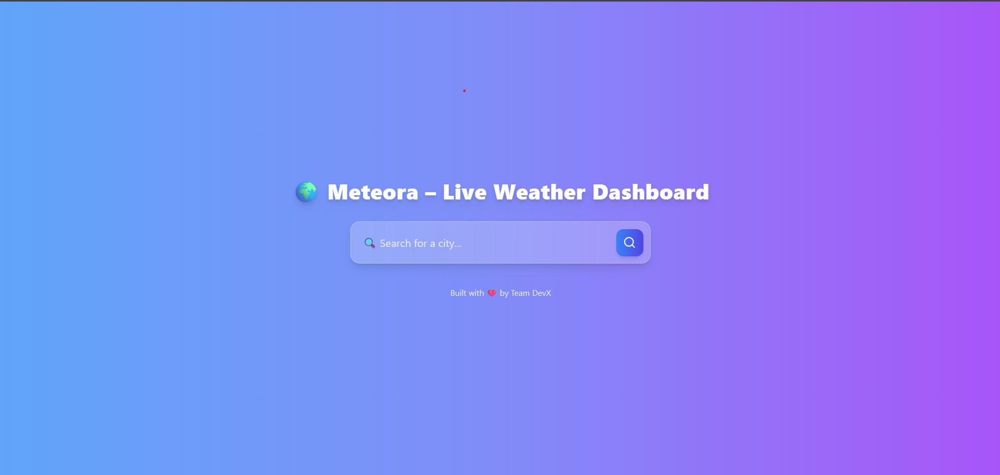
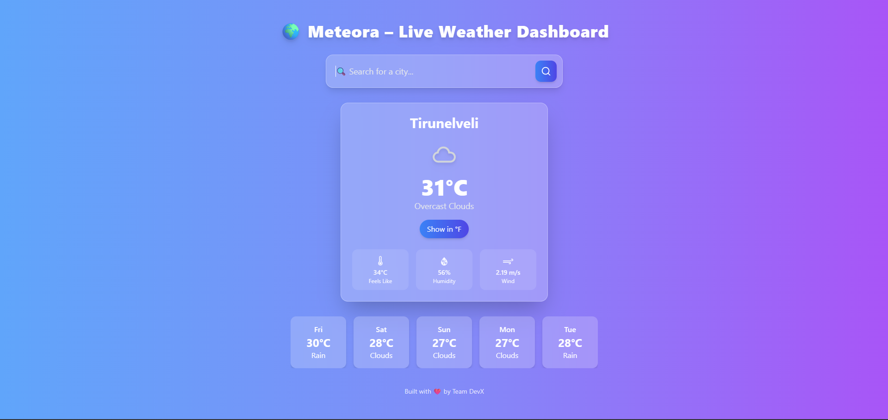

# 🌍 Meteora – Live Weather Dashboard

**Meteora** is a simple, modern, and responsive weather dashboard built using **Reactjs** and **TailwindCSS**.  
It fetches **real-time weather data** from the **OpenWeatherMap API**, showing temperature, humidity, wind speed, and a 5-day forecast in a clean visual layout.

---

## Live Link

[**Meteora**](https://meteora-weather.netlify.app/)

## 🚀 Features

- 🌦️ Live weather data using OpenWeatherMap API
- 📍 Geolocation-based weather detection
- 🔍 Search for any city worldwide
- 🌡️ Toggle between Celsius and Fahrenheit
- 🕐 5-day forecast display
- 💻 Responsive design for all devices
- 🎨 Clean UI using TailwindCSS

---

## 🧠 Tech Stack

- **Frontend Framework**: Reactjs
- **Styling**: TailwindCSS
- **API Calls**: Axios
- **Weather Data**: OpenWeatherMap API

---

## ⚙️ Installation & Setup

### 1. Clone the repository

```bash
git clone https://github.com/danielace1/react-js-mini-projects.git
```

### 2. Navigate to the project directory

```bash
cd weather-app
```

### 3. Install dependencies

```bash
npm install
```

### 4. Get OpenWeatherMap API Key

- Sign up at [OpenWeatherMap](https://openweathermap.org/) to get a free API key.
- Create a `.env` file in the root of the project and add your API key:

```
    VITE_WEATHER_API_KEY="your_api_key_here"
```

### 5. Start the development server

```bash
npm run dev
```

### 6. Open in your browser

- Open your web browser and go to `http://localhost:5173` to see the app in action.

---

## 📸 Screenshots





---

## 🤝 Contributing

We welcome contributions to **Meteora**! If you'd like to contribute, please follow these steps:

1. Fork the repository
2. Create a new branch (`git checkout -b feature/YourFeature`)
3. Make your changes
4. Commit your changes (`git commit -m 'Add some feature'`)
5. Push to the branch (`git push origin feature/YourFeature`)
6. Open a pull request

## Acknowledgements

- [OpenWeatherMap](https://openweathermap.org/) for providing the weather data API.
